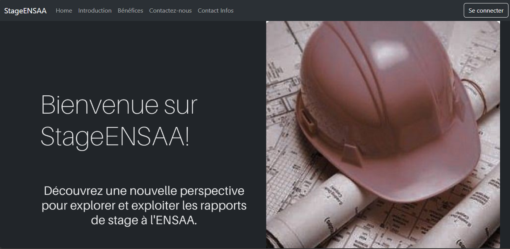
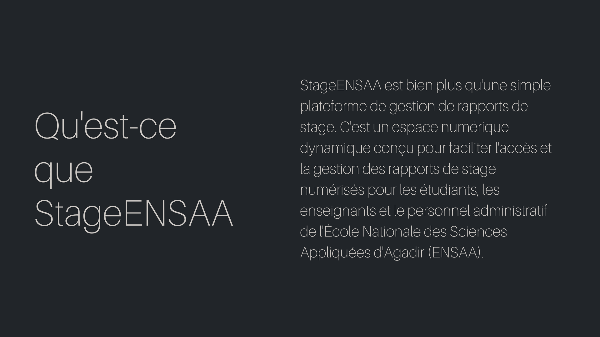
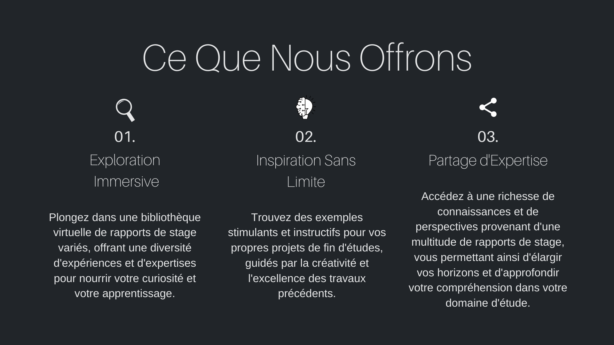

# Application de Gestion des Rapports de Stage

Bienvenue dans l'Application de Gestion des Rapports de Stage ! Notre plateforme simplifie la gestion des rapports de stage numérisés des étudiants chez Ensa Agadir. Elle propose une solution facile à utiliser pour accéder aux rapports et les télécharger, ce qui est pratique pour les étudiants comme pour les administrateurs.

## Fonctionnalités

- **Pour les étudiants**: Rechercher et télécharger des rapports par département, année ou mot-clé.
- **Pour les administrateurs**: Télécharger, modifier et supprimer des rapports pour une gestion efficace.
